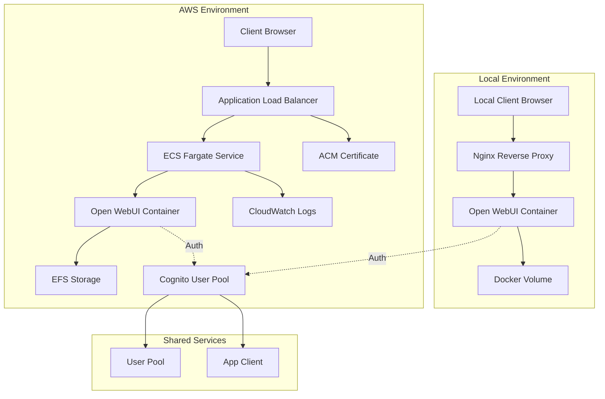
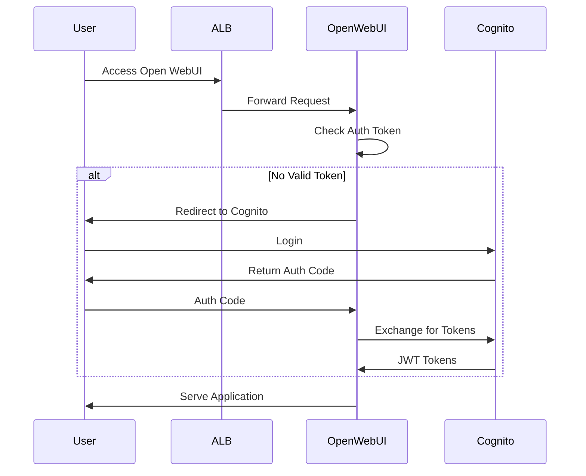

# Design Document: Open WebUI AWS Deployment with Cognito Authentication

## Overview

This design provides a comprehensive solution for deploying Open WebUI in two environments: local development using Docker Compose and production deployment on AWS using CloudFormation. The system integrates AWS Cognito for authentication in both environments, with Open WebUI running as a containerized application.

The architecture supports:
- Local development with hot-reloading and persistent storage
- AWS deployment using ECS Fargate for serverless container orchestration
- Cognito-based authentication with OAuth2/OIDC integration
- Infrastructure-as-code using CloudFormation templates
- Secure networking and IAM role-based access control

## Architecture

### High-Level Architecture



### Component Interaction Flow



## Components and Interfaces

### 1. Local Development Environment

**Docker Compose Stack:**
- **Open WebUI Container**: Official Open WebUI image with environment-specific configuration
- **Nginx Proxy** (optional): For SSL termination in local development
- **Docker Volumes**: Persistent storage for user data, models, and configurations

**Configuration:**
- Environment variables for Cognito integration (User Pool ID, Client ID, Domain)
- Port mapping for local access (default: 3000 or 8080)
- Volume mounts for data persistence
- Network configuration for container communication

### 2. AWS CloudFormation Infrastructure

**Core Resources:**

#### Networking Layer
- **VPC**: Isolated network environment with public and private subnets across multiple AZs
- **Security Groups**: 
  - ALB Security Group: Allows HTTPS (443) from internet
  - ECS Security Group: Allows traffic from ALB only
  - EFS Security Group: Allows NFS (2049) from ECS

#### Compute Layer
- **ECS Cluster**: Container orchestration platform
- **ECS Task Definition**: Defines Open WebUI container specifications
  - Container image from Docker Hub or ECR
  - CPU and memory allocation
  - Environment variables for Cognito configuration
  - Mount points for EFS volumes
- **ECS Service**: Manages desired task count, auto-scaling, and load balancer integration
- **Fargate**: Serverless compute engine for containers

#### Storage Layer
- **EFS File System**: Persistent storage for Open WebUI data
- **EFS Mount Targets**: Endpoints in each availability zone
- **EFS Access Points**: Isolated directory structures for different data types

#### Load Balancing
- **Application Load Balancer**: 
  - HTTPS listener with ACM certificate
  - Target group for ECS tasks
  - Health checks for container availability
- **ACM Certificate**: SSL/TLS certificate for custom domain

#### Authentication
- **Cognito User Pool**: User directory and authentication service
- **Cognito User Pool Client**: OAuth2 application configuration
- **Cognito Domain**: Hosted UI for login/signup

#### IAM Resources
- **ECS Task Execution Role**: Permissions for ECS to pull images and write logs
- **ECS Task Role**: Permissions for Open WebUI application (S3, Cognito, etc.)
- **CloudFormation Service Role**: Permissions for stack operations

#### Monitoring
- **CloudWatch Log Groups**: Container logs and application logs
- **CloudWatch Alarms**: Health and performance monitoring

### 3. Authentication Module Integration

**Open WebUI OAuth2/OIDC Configuration:**

Open WebUI supports OAuth2/OIDC authentication through environment variables:

```
OAUTH_CLIENT_ID=<cognito-client-id>
OAUTH_CLIENT_SECRET=<cognito-client-secret>
OAUTH_PROVIDER_NAME=Cognito
OPENID_PROVIDER_URL=https://cognito-idp.<region>.amazonaws.com/<user-pool-id>
OAUTH_SCOPES=openid profile email
OAUTH_REDIRECT_URI=<app-url>/oauth/callback
```

**Authentication Flow:**
1. User accesses Open WebUI
2. Open WebUI redirects to Cognito hosted UI
3. User authenticates with Cognito
4. Cognito redirects back with authorization code
5. Open WebUI exchanges code for JWT tokens
6. JWT tokens stored in session for subsequent requests
7. Open WebUI validates tokens on each request

### 4. Configuration Management

**Environment-Specific Configuration:**

Local (`.env.local`):
```
OAUTH_CLIENT_ID=local-client-id
OAUTH_CLIENT_SECRET=local-secret
OPENID_PROVIDER_URL=https://cognito-idp.us-east-1.amazonaws.com/us-east-1_xxxxx
OAUTH_REDIRECT_URI=http://localhost:3000/oauth/callback
DATA_DIR=/app/data
```

AWS (CloudFormation Parameters + Secrets Manager):
```
OAUTH_CLIENT_ID=<from-parameter>
OAUTH_CLIENT_SECRET=<from-secrets-manager>
OPENID_PROVIDER_URL=<constructed-from-parameters>
OAUTH_REDIRECT_URI=<from-alb-dns-or-custom-domain>
DATA_DIR=/mnt/efs/data
```

## Data Models

### Cognito User Pool Schema

**Standard Attributes:**
- email (required, verified)
- name
- preferred_username

**Custom Attributes:**
- custom:role (admin, user)
- custom:organization

**User Pool Configuration:**
- Password policy: Minimum 8 characters, requires uppercase, lowercase, numbers
- MFA: Optional (TOTP or SMS)
- Account recovery: Email-based
- Email verification: Required

### Open WebUI Data Structure

**Persistent Data (EFS/Volume):**
```
/data
  /models          # Downloaded LLM models
  /uploads         # User uploaded files
  /config          # Application configuration
  /database        # SQLite database (user preferences, chat history)
```

**Database Schema (SQLite):**
- Users table: Maps Cognito sub to local user profile
- Chats table: Conversation history
- Models table: Available LLM configurations
- Settings table: User preferences

## Error Handling

### Authentication Errors

**Token Validation Failures:**
- Invalid JWT signature → Redirect to login
- Expired token → Attempt refresh, fallback to login
- Missing required claims → Log error, redirect to login

**Cognito Service Errors:**
- User Pool unavailable → Display maintenance message, retry with exponential backoff
- Invalid client configuration → Log error, return 500 with generic message

### Infrastructure Errors

**ECS Task Failures:**
- Container health check failures → ECS automatically replaces task
- Task launch failures → CloudWatch alarm triggers, manual intervention required

**EFS Mount Failures:**
- Mount target unavailable → Task fails to start, ECS retries
- Permission denied → Check security groups and IAM roles

**ALB Health Check Failures:**
- Unhealthy targets → ALB stops routing traffic, ECS launches replacement
- All targets unhealthy → Return 503 Service Unavailable

### Application Errors

**LLM Interaction Errors:**
- Model loading failure → Display error to user, log to CloudWatch
- Inference timeout → Return timeout error, allow retry
- Out of memory → Container restart, consider increasing task memory

**Data Persistence Errors:**
- EFS write failure → Display error, retry with exponential backoff
- Database corruption → Restore from backup, log critical error

## Testing Strategy

### Local Development Testing

**Unit Tests:**
- Authentication flow mocking
- Configuration validation
- Environment variable parsing

**Integration Tests:**
- Docker Compose stack startup
- Cognito authentication end-to-end
- Data persistence across container restarts
- Health check endpoints

**Manual Testing:**
- Login/logout flows
- LLM interaction
- File upload/download
- Session management

### AWS Deployment Testing

**Infrastructure Tests:**
- CloudFormation template validation (cfn-lint)
- Parameter validation
- Resource dependency verification

**Deployment Tests:**
- Stack creation in test environment
- Resource creation verification
- Security group rule validation
- IAM role permission verification

**End-to-End Tests:**
- ALB health checks passing
- HTTPS certificate validation
- Cognito authentication flow
- EFS data persistence
- Container logging to CloudWatch

**Security Tests:**
- Port scanning (only 443 should be open)
- JWT token validation
- IAM role least-privilege verification
- Encryption at rest verification

**Performance Tests:**
- Load testing with multiple concurrent users
- Container auto-scaling behavior
- EFS throughput under load

### Continuous Testing

**Automated Checks:**
- CloudFormation drift detection
- Security group audit
- Certificate expiration monitoring
- Cost anomaly detection

## Security Considerations

### Network Security
- All external traffic over HTTPS only
- Private subnets for ECS tasks
- Security groups with minimal required access
- VPC Flow Logs enabled

### Authentication Security
- JWT token validation on every request
- Secure token storage (httpOnly cookies)
- Token refresh mechanism
- Session timeout configuration

### Data Security
- EFS encryption at rest using AWS KMS
- Secrets stored in AWS Secrets Manager
- IAM roles with least-privilege access
- CloudWatch Logs encryption

### Compliance
- CloudTrail logging for audit trail
- VPC Flow Logs for network monitoring
- Container image scanning for vulnerabilities
- Regular security updates for base images

## Deployment Process

### Local Deployment
1. Clone repository
2. Copy `.env.example` to `.env.local`
3. Configure Cognito parameters
4. Run `docker-compose up`
5. Access at `http://localhost:3000`

### AWS Deployment
1. Create Cognito User Pool (or use existing)
2. Store client secret in Secrets Manager
3. Validate CloudFormation template
4. Deploy stack with parameters
5. Wait for stack creation (15-20 minutes)
6. Configure DNS (optional)
7. Test authentication flow
8. Monitor CloudWatch metrics

## Scalability and Performance

### Horizontal Scaling
- ECS Service auto-scaling based on CPU/memory
- ALB distributes traffic across tasks
- Multiple AZ deployment for high availability

### Vertical Scaling
- Adjustable task CPU and memory via parameters
- EFS scales automatically with usage

### Performance Optimization
- ALB connection draining for graceful shutdowns
- EFS provisioned throughput for consistent performance
- CloudFront CDN for static assets (optional enhancement)

## Cost Optimization

**Local Development:**
- Zero AWS costs when running locally
- Minimal resource usage on developer machine

**AWS Deployment:**
- Fargate pricing based on vCPU and memory per second
- EFS pricing based on storage used
- ALB pricing based on hours and LCU usage
- Cognito free tier: 50,000 MAUs
- Cost allocation tags for tracking

**Optimization Strategies:**
- Use Fargate Spot for non-production environments
- EFS Infrequent Access storage class for old data
- Auto-scaling to match demand
- Scheduled scaling for predictable patterns
