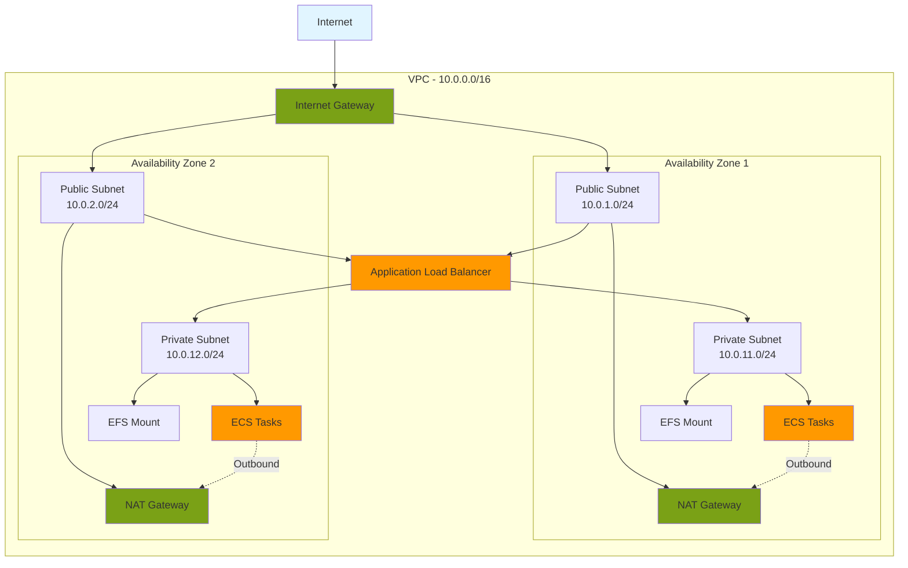
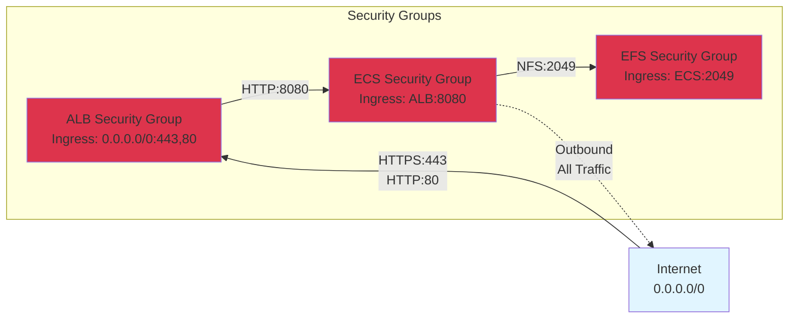
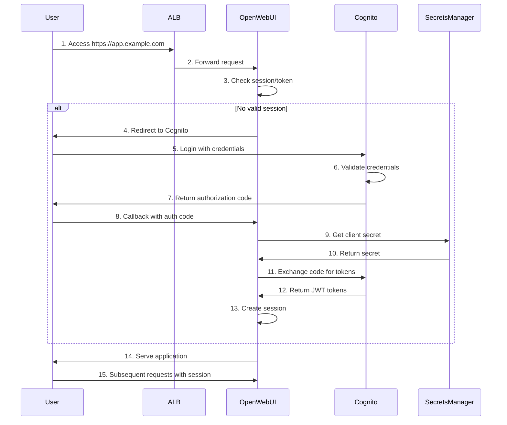
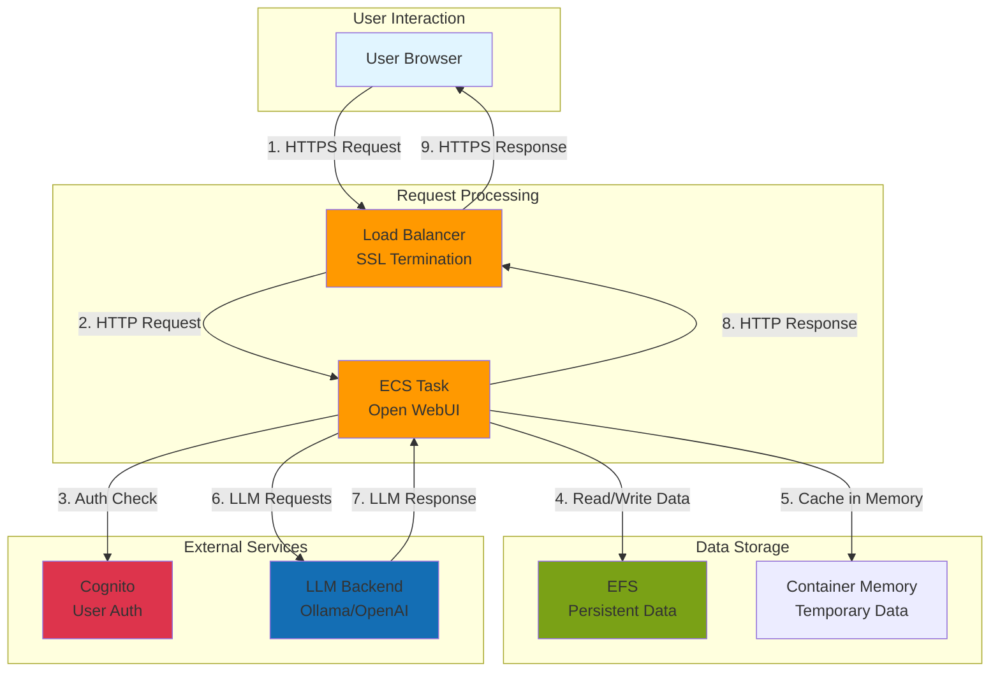
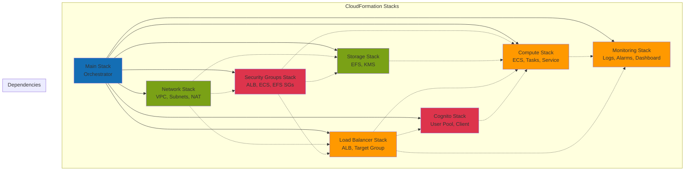
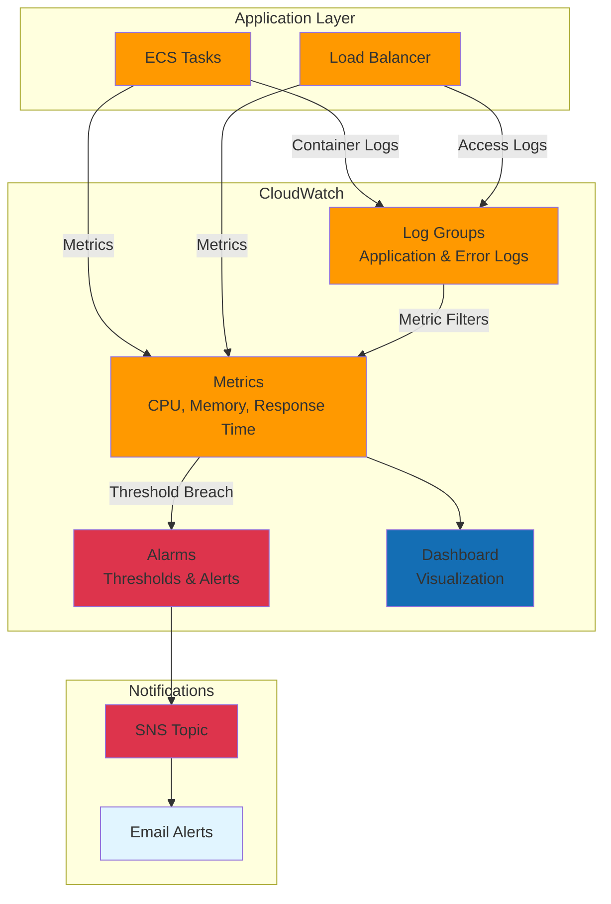
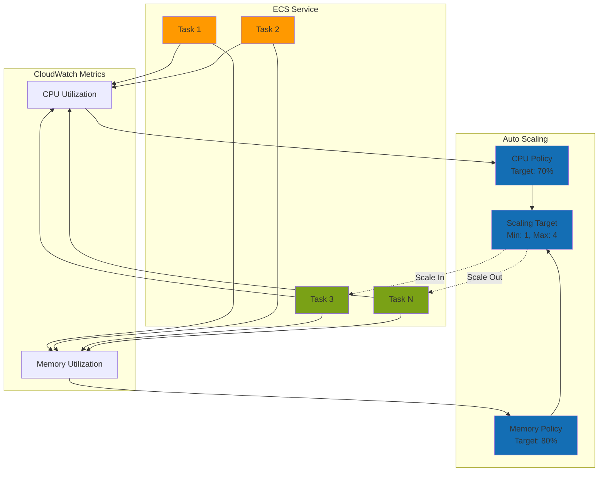
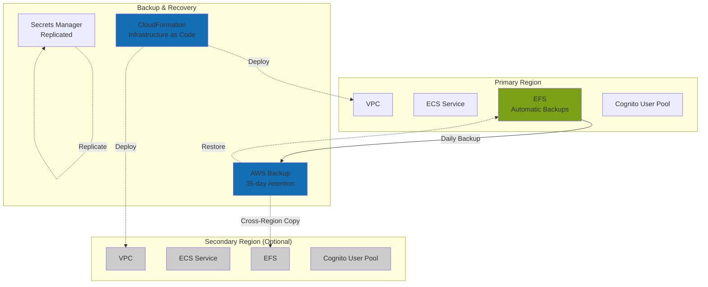

# Architecture Documentation

This document provides detailed architecture diagrams and explanations for the Open WebUI deployment.

## High-Level Architecture

```mermaid
graph TB
    subgraph "User Access"
        User[User Browser]
    end
    
    subgraph "AWS Cloud"
        subgraph "Public Subnets - Multi-AZ"
            ALB[Application Load Balancer<br/>HTTPS:443]
            NAT1[NAT Gateway AZ1]
            NAT2[NAT Gateway AZ2]
        end
        
        subgraph "Private Subnets - Multi-AZ"
            ECS1[ECS Task AZ1<br/>Open WebUI Container]
            ECS2[ECS Task AZ2<br/>Open WebUI Container]
            EFS1[EFS Mount Target AZ1]
            EFS2[EFS Mount Target AZ2]
        end
        
        subgraph "Storage"
            EFS[EFS File System<br/>Encrypted]
        end
        
        subgraph "Authentication"
            Cognito[Cognito User Pool<br/>OAuth2/OIDC]
        end
        
        subgraph "Secrets"
            Secrets[Secrets Manager<br/>Client Secret, Keys]
        end
        
        subgraph "Monitoring"
            CW[CloudWatch<br/>Logs, Metrics, Alarms]
        end
    end
    
    User -->|HTTPS| ALB
    ALB -->|HTTP:8080| ECS1
    ALB -->|HTTP:8080| ECS2
    ECS1 -->|NFS| EFS1
    ECS2 -->|NFS| EFS2
    EFS1 --> EFS
    EFS2 --> EFS
    ECS1 -.->|Auth| Cognito
    ECS2 -.->|Auth| Cognito
    User -.->|Login| Cognito
    ECS1 -.->|Read| Secrets
    ECS2 -.->|Read| Secrets
    ECS1 -->|Logs| CW
    ECS2 -->|Logs| CW
    ECS1 -->|Internet| NAT1
    ECS2 -->|Internet| NAT2
    
    style User fill:#e1f5ff
    style ALB fill:#ff9900
    style ECS1 fill:#ff9900
    style ECS2 fill:#ff9900
    style EFS fill:#7aa116
    style Cognito fill:#dd344c
    style Secrets fill:#dd344c
    style CW fill:#ff9900
```

## Network Architecture



## Security Groups Architecture



## Authentication Flow



## Data Flow Architecture



## Deployment Architecture



## Monitoring Architecture



## Auto-Scaling Architecture



## Disaster Recovery Architecture



## Key Architecture Decisions

### Multi-AZ Deployment
- **Why**: High availability and fault tolerance
- **Components**: ALB, NAT Gateways, ECS tasks, EFS mount targets
- **Benefit**: Automatic failover if one AZ fails

### Private Subnets for Compute
- **Why**: Security best practice
- **Components**: ECS tasks, EFS mount targets
- **Benefit**: No direct internet access, reduced attack surface

### EFS for Persistent Storage
- **Why**: Shared file system across multiple containers
- **Components**: User data, models, chat history
- **Benefit**: Data persists across container restarts and scaling

### Fargate Launch Type
- **Why**: Serverless, no EC2 management
- **Components**: ECS tasks
- **Benefit**: Automatic scaling, pay-per-use, no server maintenance

### Application Load Balancer
- **Why**: Layer 7 routing, SSL termination, health checks
- **Components**: HTTPS listener, target group
- **Benefit**: Automatic SSL/TLS, path-based routing, WebSocket support

### Cognito for Authentication
- **Why**: Managed authentication service
- **Components**: User pool, app client, hosted UI
- **Benefit**: OAuth2/OIDC support, MFA, user management

### Secrets Manager
- **Why**: Secure credential storage
- **Components**: Client secret, session keys
- **Benefit**: Automatic rotation, encryption, audit logging

### CloudWatch for Monitoring
- **Why**: Integrated AWS monitoring
- **Components**: Logs, metrics, alarms, dashboards
- **Benefit**: Real-time visibility, alerting, troubleshooting

## Scalability Considerations

### Horizontal Scaling
- ECS auto-scaling based on CPU/memory
- ALB distributes traffic across tasks
- EFS scales automatically with usage

### Vertical Scaling
- Adjustable task CPU and memory
- Configurable via CloudFormation parameters
- No downtime for scaling up

### Performance Optimization
- EFS provisioned throughput mode available
- ALB connection draining for graceful shutdowns
- CloudWatch Container Insights for detailed metrics

## Security Layers

1. **Network Security**: VPC, private subnets, security groups
2. **Transport Security**: HTTPS only, TLS 1.3
3. **Authentication**: Cognito OAuth2/OIDC
4. **Authorization**: Cognito groups (Admins, Users)
5. **Data Encryption**: EFS at rest (KMS), TLS in transit
6. **Secrets Management**: Secrets Manager with encryption
7. **Monitoring**: CloudWatch logs, VPC Flow Logs, CloudTrail
8. **IAM**: Least-privilege roles for ECS tasks

## Cost Optimization Strategies

1. **EFS Lifecycle Policies**: Move infrequently accessed data to IA storage
2. **Auto-Scaling**: Scale down during low usage
3. **Fargate Spot**: Use Spot pricing for non-production (up to 70% savings)
4. **Single NAT Gateway**: Reduce to one NAT for dev environments
5. **Log Retention**: Shorter retention for non-critical logs
6. **Reserved Capacity**: Consider Savings Plans for predictable workloads

## References

- [AWS Well-Architected Framework](https://aws.amazon.com/architecture/well-architected/)
- [ECS Best Practices](https://docs.aws.amazon.com/AmazonECS/latest/bestpracticesguide/)
- [VPC Design Best Practices](https://docs.aws.amazon.com/vpc/latest/userguide/vpc-design-best-practices.html)
